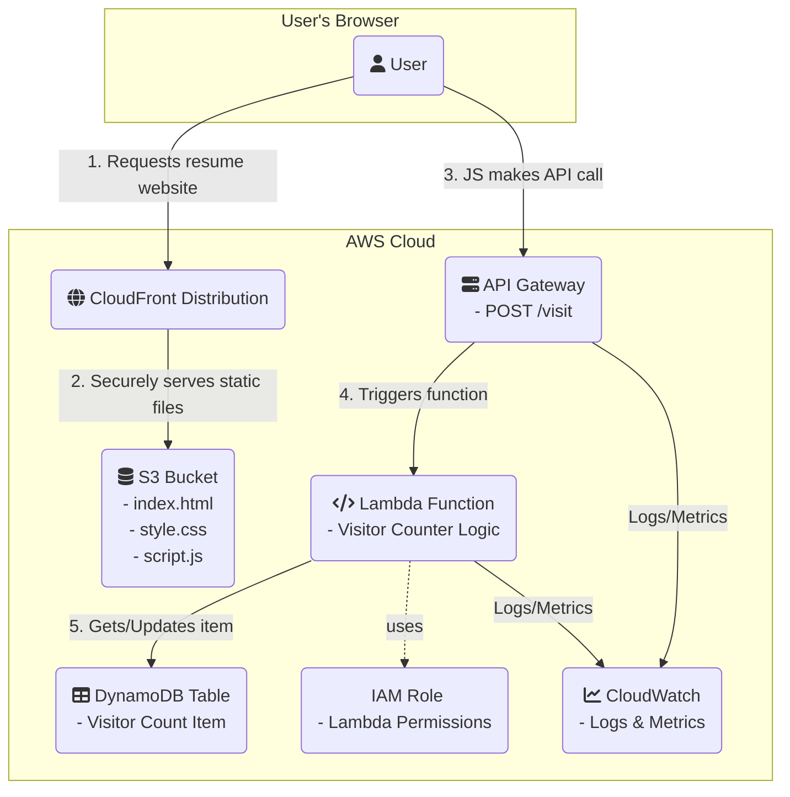

# **AWS Serverless Portfolio Website**

**Live Demo:** [https://https://d1ibk6q0hov7af.cloudfront.net/) ---

This project is a personal portfolio and resume website built on a completely serverless architecture in AWS. The entire infrastructure is defined as code using Terraform and deployed automatically via a CI/CD pipeline with GitHub Actions.

### **Key Features & Description**

* [cite_start]Architected a secure and scalable serverless portfolio website hosted on S3, delivered globally via CloudFront, and powered by a backend API using Lambda, API Gateway, and DynamoDB for dynamic content[cite: 14, 15].
* [cite_start]Automated the entire infrastructure deployment using Terraform (Infrastructure as Code) and built a complete CI/CD pipeline with GitHub Actions to streamline the development and release process[cite: 16].

### **Architecture Diagram**

### **Tech Stack**

* [cite_start]**Cloud:** AWS (S3, CloudFront, Lambda, API Gateway, DynamoDB, IAM) [cite: 12]
* [cite_start]**Infrastructure as Code (IaC):** Terraform [cite: 29]
* **CI/CD:** GitHub Actions
* [cite_start]**Languages:** Python, JavaScript, HTML/CSS [cite: 29]

---
*This project was built as a practical, hands-on learning experience.*
## Final Update
