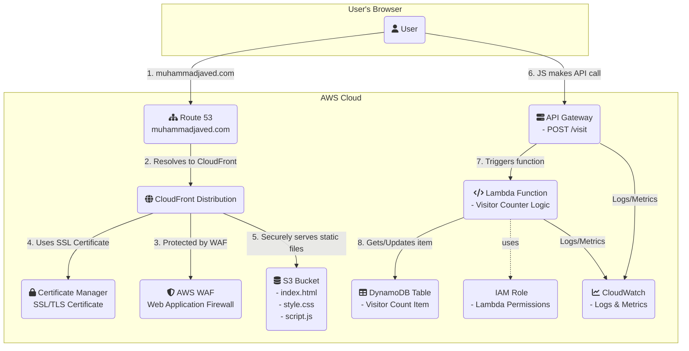

# AWS Serverless Portfolio Website

**Live Demo:** [https://www.muhammadjaved.com](https://www.muhammadjaved.com)

---

This project is a personal portfolio and resume website built on a completely serverless architecture within AWS. The entire infrastructure is defined as code using Terraform and deployed automatically via a CI/CD pipeline with GitHub Actions. The application is secured with a custom domain, HTTPS, and a Web Application Firewall (WAF).

### Key Features

* **Secure & Production-Ready:** Deployed with a custom domain from Route 53, an SSL/TLS certificate from AWS Certificate Manager (ACM) for HTTPS, and protected by AWS WAF to mitigate common web exploits.
* **Serverless Architecture:** Utilizes AWS Lambda, API Gateway, and DynamoDB to create a dynamic backend without managing servers.
* **Global Content Delivery:** Leverages Amazon S3 for static hosting and CloudFront as a CDN for low-latency, secure content delivery worldwide.
* **Infrastructure as Code (IaC):** The entire AWS infrastructure is defined and managed in Terraform, enabling consistent and repeatable deployments.
* **Automated CI/CD:** A GitHub Actions workflow automatically deploys any changes pushed to the `main` branch, streamlining the development and release process.

### Architecture Diagram

Tech Stack
Cloud & Networking: AWS (S3, CloudFront, Lambda, API Gateway, DynamoDB, IAM, Route 53, ACM, WAF)

Infrastructure as Code (IaC): Terraform

CI/CD: GitHub Actions

Languages: Python, JavaScript, HTML/CSS

This project was built as a practical, hands-on learning experience.
